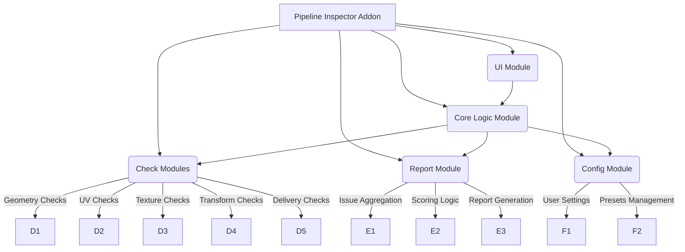
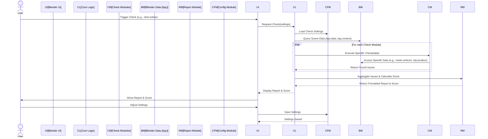

# 架构设计 (Architecture Design)

Pipeline Inspector 的架构设计将围绕 Blender 插件的开发范式，重点关注模块化、可扩展性和数据流的清晰性。本阶段不涉及具体代码实现，而是定义高层级的结构和交互。

## Blender Architecture Integration (Blender 架构集成)

Pipeline Inspector 将作为一个 Blender 插件（Add-on）运行，深度集成到 Blender 的现有架构中。这意味着它将利用 Blender 的 Python API (bpy) 来访问场景数据、几何体、材质、UV、变换等信息，并与 Blender 的用户界面（UI）进行交互。

*   **用户界面 (UI)**：插件将通过 Blender 的自定义面板（Panel）或侧边栏（Sidebar）提供用户界面，允许用户触发检查、查看报告和配置设置。
*   **数据访问 (Data Access)**：通过 `bpy.data` 和 `bpy.context` 访问场景中的所有数据块（如对象、网格、材质、纹理、集合等）。
*   **事件处理 (Event Handling)**：利用 Blender 的事件系统（如文件保存前、导出前）触发自动检查，或通过操作符（Operator）响应用户手动触发的检查。
*   **后台操作 (Background Operations)**：对于耗时较长的检查，可以考虑使用 Blender 的后台作业系统（如 `bpy.app.timers` 或 `modal operators`）来避免阻塞 UI。

## Module Structure (模块结构)

Pipeline Inspector 将采用模块化设计，以便于维护、扩展和测试。核心模块包括：

*   **UI Module (用户界面模块)**：负责插件在 Blender 中的所有用户界面元素，包括面板、按钮、属性显示等。它将调用核心逻辑模块来执行操作并显示结果。
*   **Core Logic Module (核心逻辑模块)**：作为插件的中央协调器，负责管理检查流程、调用各个检查模块、聚合检查结果，并与报告模块和配置模块交互。
*   **Check Modules (检查模块)**：这是一组独立的模块，每个模块负责特定类别的检查（例如，几何体检查、UV 检查、纹理检查等）。每个检查模块将包含多个具体的检查函数，返回发现的问题列表。
    *   **Geometry Checks (几何体检查)**：处理非流形、N-gon、翻转法线等。
    *   **UV Checks (UV 检查)**：处理 UV 缺失、重叠、拉伸等。
    *   **Texture Checks (纹理检查)**：处理纹理缺失、路径断裂等。
    *   **Transform Checks (变换检查)**：处理缩放、旋转、位置等。
    *   **Delivery Checks (交付规范检查)**：处理命名、集合组织、导出就绪等。
*   **Report Module (报告模块)**：负责接收核心逻辑模块聚合的问题数据，进行问题分类、严重性评估（Blocking Issue/Warning），计算“READY FOR DELIVERY”评分，并生成用户友好的报告。
*   **Config Module (配置模块)**：负责管理插件的设置和用户偏好，包括自定义检查规则、命名规范预设、导出预设等。

## Data Flow (数据流)

数据流描述了信息在 Pipeline Inspector 内部以及与 Blender 之间如何传递和处理。

1.  **用户触发检查**：用户通过 Blender UI 中的按钮或菜单项触发检查操作。
2.  **UI 调用核心逻辑**：UI 模块将检查请求（可能包含用户配置的设置）传递给核心逻辑模块。
3.  **加载配置**：核心逻辑模块从配置模块加载当前的检查设置和预设。
4.  **查询 Blender 数据**：核心逻辑模块通过 Blender Python API (bpy) 访问当前场景中的相关数据（如所有对象、网格、材质、UV 贴图等）。
5.  **执行检查模块**：核心逻辑模块遍历所有注册的检查模块，并为每个模块提供所需的数据。每个检查模块独立执行其特定的验证逻辑，并返回发现的问题列表。
6.  **聚合与评分**：核心逻辑模块收集所有检查模块返回的问题，将它们聚合起来，并根据预定义的评分系统计算“READY FOR DELIVERY”分数，区分 Blocking Issues 和 Warnings。
7.  **生成报告**：聚合后的问题数据和分数被传递给报告模块，由报告模块生成结构化、易读的检查报告。
8.  **显示结果**：核心逻辑模块将最终的报告和分数返回给 UI 模块，UI 模块负责在 Blender 界面中向用户展示这些信息。
9.  **用户调整设置**：用户可以通过 UI 调整检查设置，这些设置将通过配置模块进行保存，以供后续检查使用。

这个架构旨在提供一个清晰的分层结构，使得每个组件职责明确，便于未来的功能扩展和维护。
